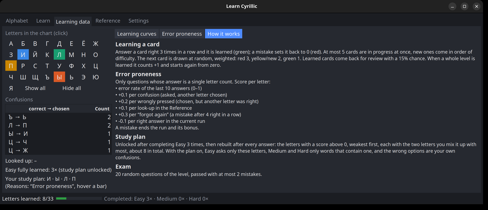
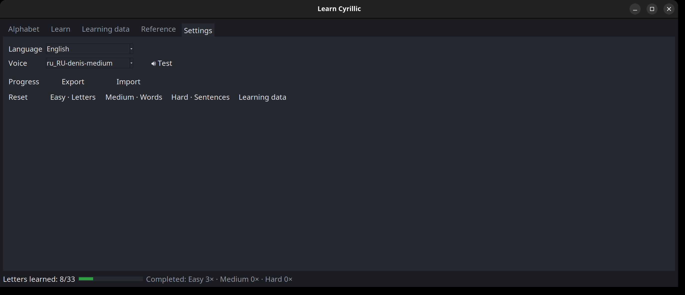

# Learn Cyrillic

A small desktop app for learning to read the Cyrillic (Russian) alphabet – from single letters to words
and whole sentences, with spoken pronunciation, learning statistics and a personal study plan.

- **Platform:** Linux (Python + tkinter, audio via `paplay` / `spd-say`)
- **Dependencies:** none beyond the Python standard library; [Piper](https://github.com/OHF-Voice/piper1-gpl)
  is optional for a natural-sounding voice


## Features

### Alphabet
All 33 letters at a glance, colored by learning status (new / wrong / in progress / learned).
Click a letter to see its name, pronunciation and an example word – and hear it spoken.


### Learn
Multiple-choice quiz that works like a driving-school theory app: every card has to be answered correctly
**three times in a row** to count as learned; a mistake resets the streak. New cards are introduced in
small batches, easiest first, learned ones come back now and then for review.

- **Three levels:** Easy – letters (sound ↔ letter), Medium – words (read, write, meaning, translate, missing
  letter, listen, listen → meaning) and Hard – sentences (read, write, meaning, translate, missing word, listen)
- **Transliteration** in a simple English style (zh, kh, ts, ch, sh, shch, ya, yu …)
- **Smart distractors:** similar-looking letters, typical misreadings and spelling mix-ups
- **Exam mode:** one exam per level, 20 questions, at most 2 mistakes – unlocked once the level was completed
  3 times and the study plan has at most 1 letter
- **Listen only:** train purely by ear (words and sentences)
- **Words made easier:** cognates (музей, метро, банк …) come first, every word has a short example sentence
  (shown after answering and in the hint), and "What does the word you hear mean?" trains the meaning by ear
- **Free practice:** quiz any level without counting anything – no progress, no learning data, no completed
  rounds (the exam is off meanwhile). A **Hint** button behind the word explains how it is written and why
  (letter by letter, false friends, soft/hard sign, е/ё/й rules), and 🔊 plays the right word. After a mistake
  the quiz waits for **Next**, so you can open the hint first
- **Study plan mode:** practice only your weak letters (see below)


### Learning data
Every letter answer is recorded, so you can see how you actually learn:

- **Learning curves** per letter (hit rate over the last 5 attempts) – pick single letters or show all 33
- **Confusions:** which letter you mixed up with which, and how often
- **Error proneness:** one row for each of the 33 letters, weakest first, study-plan letters (★) on top. Mistakes
  grow to the right – recent error rate, times confused, times *wrongly pressed*, times looked up in the reference
  and times *forgot again* (a mistake after 4 right in a row). Right answers grow to the left in green (a mistake
  halves that bonus), and a dot marks the real score. Letters that dropped out of the plan get a ✓. Hover a row
  for the full breakdown.
- **How it works:** explains the learning algorithm, all weights, the study plan and the exam.




### Personal study plan
After you have completed the Easy level (all letters learned) **three times**, there is enough data for a
personal study plan: every letter whose score is above 0, as many as there are. The plan updates itself after
every answer – once right answers push a letter to 0 or below it drops out, and when mistakes push it above 0
again it comes back. An empty plan means no letter is weak right now. With the plan active,
the quiz asks only those letters, uses your own confusions as wrong answers, and on the word and sentence
levels picks words that contain them.

### Reference
All letters grouped by difficulty – from "looks and sounds familiar" to the "false friends" that look
Latin but sound different. Click a row to hear the example word. Looking up a letter counts towards the
study plan.


### Completed rounds
When every card of a level is learned (e.g. 33/33 letters), the level counts as completed once and its
progress starts again from zero – the first 3 times. After the third round the level stays learned, so you can
keep working on your weak letters (study plan); only the reset button in Settings starts it from zero again.
The status bar shows how often each level was completed and how many exams were passed per level
(e.g. *Completed: Easy 3× · Medium 1× · Hard 0×   Exams passed: Easy 1× · Medium 0× · Hard 0×*).

### Settings
- **Language:** English or German (Deutsch) – the whole app including meanings and pronunciation hints.
  Switching restarts the app.
- **Voice:** pick one of the Piper voices in `voices/` and test it.
- **Export / import:** save your whole progress including all learning data to a JSON file and restore it
  later or on another machine. Imported files are validated before anything is replaced.
- **Reset:** clear the progress of a single level, or the learning data (statistics and study plan).



## Installation

Ready-made versions are listed under [Releases](https://github.com/RedEyeArchangel/Learn-Cyrillic/releases).

Requires Python ≥ 3.8 with tkinter (`sudo apt install python3-tk` on Debian/Ubuntu).

```sh
git clone https://github.com/RedEyeArchangel/Learn-Cyrillic.git
cd Learn-Cyrillic
python3 learn_cyrillic.py
```

### Better voice (optional)

Without Piper the app uses the system speech output (`sudo apt install speech-dispatcher espeak-ng`).
For a natural Russian voice:

```sh
python3 -m venv .venv
.venv/bin/pip install -r requirements.txt
# download one or more voices into voices/ – see voices/README.md
.venv/bin/python learn_cyrillic.py
```

### Run

From the project folder:

```sh
source .venv/bin/activate   # only if you set up the better voice
./learn_cyrillic.py
```

`./learn_cyrillic.py` uses whichever `python3` is active, so with the venv activated you get the Piper
voice, without it the system voice. Without activating, `.venv/bin/python learn_cyrillic.py` does the same
in one line. `deactivate` leaves the venv again.

Self-test: `./learn_cyrillic.py --test` (prints `ok`).

## Usage notes

- Progress is saved automatically to `~/.local/share/learn-cyrillic/progress.json`, language and voice to
  `settings.json` in the same folder (not part of export/import).
- The reset buttons in Settings reset one level (learning data is kept) or only the learning data.

## Project structure

```
learn_cyrillic.py          entry point
cyrillic/
  data.py                  alphabet, words, sentences, sounds
  questions.py             transliteration, cards, quiz questions
  scheduler.py             streaks, status, next card, completed rounds, exam unlock
  stats.py                 history, confusions, error proneness, study plan
  storage.py               load / validate / save progress
  settings.py              language and voice settings
  i18n.py                  German texts (English is the key)
  sound.py                 Piper voices, fanfare
  selftest.py              self-test
  gui/
    theme.py               dark theme and colors
    app.py                 main window, status bar, settings tab, export/import, speech
    tab_alphabet.py · tab_learn.py · tab_stats.py · tab_reference.py
voices/                    Piper voice models (not in the repository)
```

## License

Copyright © 2026 RedEyeArchangel

Licensed under [CC BY-NC-SA 4.0](https://creativecommons.org/licenses/by-nc-sa/4.0/) – see [LICENSE](LICENSE).

- **Non-commercial use only.**
- **Attribution required:** if you use this project or parts of it as a basis for your own work, you must
  credit it, for example:
  > Based on "Learn Cyrillic" by RedEyeArchangel (https://github.com/RedEyeArchangel/Learn-Cyrillic),
  > licensed under CC BY-NC-SA 4.0.
- **Share alike:** derived works must be released under the same license.

### Third-party components

- [Piper](https://github.com/OHF-Voice/piper1-gpl) (`piper-tts`, GPL-3.0-or-later) is an optional
  dependency, installed separately and not included in this repository.
- The Piper voice models are not included and have their own licenses (see `voices/README.md`).

## 💖 Support the Project

If you find this project useful, consider supporting its development:

[](https://github.com/sponsors/RedEyeArchangel)

*Your support helps maintain open-source projects like this and enables new features to be built!*
