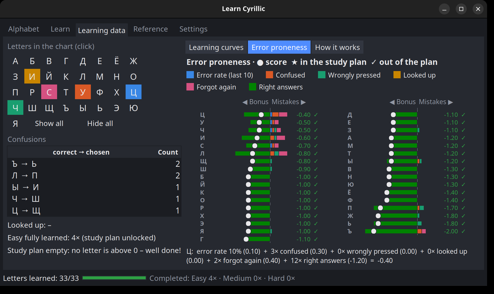
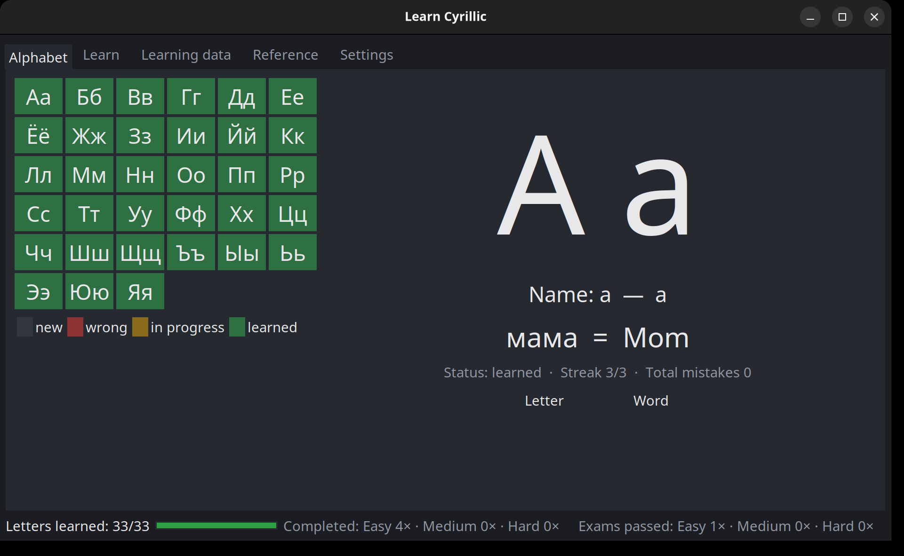
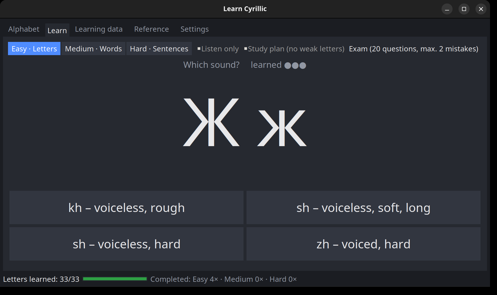
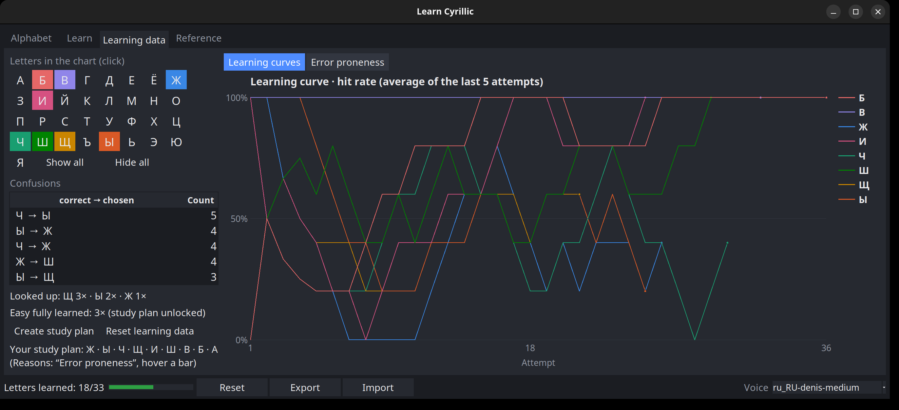
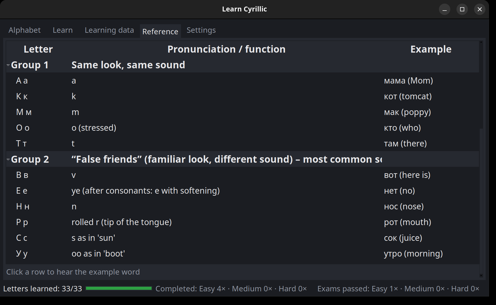

# Learn Cyrillic

A small desktop app for learning to read the Cyrillic (Russian) alphabet – from single letters to words
and whole sentences, with spoken pronunciation, learning statistics and a personal study plan.

- **Platform:** Linux (Python + tkinter, audio via `paplay` / `spd-say`)
- **Dependencies:** none beyond the Python standard library; [Piper](https://github.com/OHF-Voice/piper1-gpl)
  is optional for a natural-sounding voice



## Features

### Alphabet
All 33 letters at a glance, colored by learning status (new / wrong / in progress / learned).
Click a letter to see its name, pronunciation and an example word – and hear it spoken.



### Learn
Multiple-choice quiz that works like a driving-school theory app: every card has to be answered correctly
**three times in a row** to count as learned; a mistake resets the streak. New cards are introduced in
small batches, easiest first, learned ones come back now and then for review.

- **Three levels:** Easy – letters (sound ↔ letter), Medium – words (read, write, meaning, translate, missing letter, listen) and
  Hard – sentences (read, write, meaning, translate, missing word, listen)
- **Transliteration** in a simple English style (zh, kh, ts, ch, sh, shch, ya, yu …)
- **Smart distractors:** similar-looking letters, typical misreadings and spelling mix-ups
- **Exam mode:** 20 questions, at most 2 mistakes
- **Listen only:** train purely by ear (words and sentences)
- **Study plan mode:** practice only your weak letters (see below)



### Learning data
Every letter answer is recorded, so you can see how you actually learn:

- **Learning curves** per letter (hit rate over the last 5 attempts) – pick single letters or show all 33
- **Confusions:** which letter you mixed up with which, and how often
- **Error proneness:** a stacked bar per letter showing exactly how its weight is made up –
  recent error rate, times confused, times *wrongly pressed*, and times looked up in the reference.
  Hover a bar for the full breakdown.



### Personal study plan
After you have completed the Easy level (all letters learned) **three times**, there is enough data to create a
personal study plan: your weakest letters plus the letters you confuse them with. With the plan active,
the quiz asks only those letters, uses your own confusions as wrong answers, and on the word and sentence
levels picks words that contain them.

### Reference
All letters grouped by difficulty – from "looks and sounds familiar" to the "false friends" that look
Latin but sound different. Click a row to hear the example word. Looking up a letter counts towards the
study plan.



### Completed rounds
When every card of a level is learned (e.g. 33/33 letters), the level counts as completed once and its
progress starts again from zero. The status bar shows how often each level was completed
(e.g. *Completed: Easy 2× · Medium 1× · Hard 0×*).

### Settings
- **Language:** English or German (Deutsch) – the whole app including meanings and pronunciation hints.
  Switching restarts the app.
- **Voice:** pick one of the Piper voices in `voices/` and test it.
- **Export / import:** save your whole progress including all learning data to a JSON file and restore it
  later or on another machine. Imported files are validated before anything is replaced.
- **Reset:** clear the progress of a single level, or the learning data (statistics and study plan).

## Installation

Requires Python ≥ 3.8 with tkinter (`sudo apt install python3-tk` on Debian/Ubuntu).

```sh
git clone https://github.com/RedEyeArchangel/<repository>.git
cd <repository>
python3 learn_cyrillic.py
```

### Better voice (optional)

Without Piper the app uses the system speech output (`sudo apt install speech-dispatcher espeak-ng`).
For a natural Russian voice:

```sh
python3 -m venv .venv
.venv/bin/pip install -r requirements.txt
# download one or more voices into voices/ – see voices/README.md
.venv/bin/python learn_cyrillic.py
```

### Run

From the project folder:

```sh
source .venv/bin/activate   # only if you set up the better voice
./learn_cyrillic.py
```

`./learn_cyrillic.py` uses whichever `python3` is active, so with the venv activated you get the Piper
voice, without it the system voice. Without activating, `.venv/bin/python learn_cyrillic.py` does the same
in one line. `deactivate` leaves the venv again.

Self-test: `./learn_cyrillic.py --test` (prints `ok`).

## Usage notes

- Progress is saved automatically to `~/.local/share/learn-cyrillic/progress.json`, language and voice to
  `settings.json` in the same folder (not part of export/import).
- The reset buttons in Settings reset one level (learning data is kept) or only the learning data.

## Project structure

```
learn_cyrillic.py          entry point
cyrillic/
  data.py                  alphabet, words, sentences, sounds
  questions.py             transliteration, cards, quiz questions
  scheduler.py             streaks, status, next card
  stats.py                 history, confusions, error proneness, study plan
  storage.py               load / validate / save progress
  settings.py              language and voice settings
  i18n.py                  German texts (English is the key)
  sound.py                 Piper voices, fanfare
  selftest.py              self-test
  gui/
    theme.py               dark theme and colors
    app.py                 main window, status bar, settings tab, export/import, speech
    tab_alphabet.py · tab_learn.py · tab_stats.py · tab_reference.py
voices/                    Piper voice models (not in the repository)
```

## License

Copyright © 2026 RedEyeArchangel

Licensed under [CC BY-NC-SA 4.0](https://creativecommons.org/licenses/by-nc-sa/4.0/) – see [LICENSE](LICENSE).

- **Non-commercial use only.**
- **Attribution required:** if you use this project or parts of it as a basis for your own work, you must
  credit it, for example:
  > Based on "Learn Cyrillic" by RedEyeArchangel (https://github.com/RedEyeArchangel/&lt;repository&gt;),
  > licensed under CC BY-NC-SA 4.0.
- **Share alike:** derived works must be released under the same license.

### Third-party components

- [Piper](https://github.com/OHF-Voice/piper1-gpl) (`piper-tts`, GPL-3.0-or-later) is an optional
  dependency, installed separately and not included in this repository.
- The Piper voice models are not included and have their own licenses (see `voices/README.md`).
